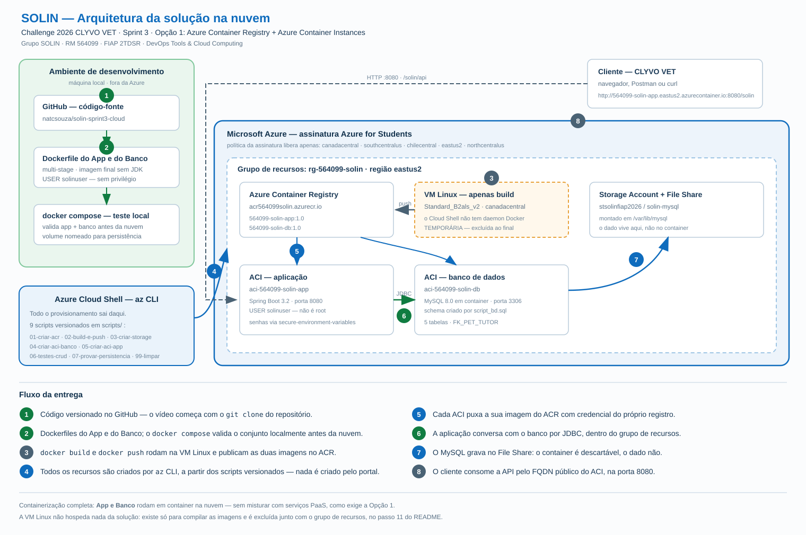

# SOLIN — Monitoramento preventivo da saúde do pet

**Challenge 2026 CLYVO VET · Sprint 3**
DevOps Tools & Cloud Computing — FIAP — 2TDSR — 2026

Aplicação e banco de dados **totalmente conteinerizados na nuvem**, com as imagens
registradas no **Azure Container Registry** e executadas em **Azure Container
Instances**. Todos os recursos são criados via **Azure CLI**.

---

## Equipe

| RM | Nome completo |
|---|---|
| 564099 | Natalia Cristina de Souza |
| 564105 | Nickolas Davi Silva Souza |
| 565162 | Rodrigo Carvalho Silva |
| 565960 | Otávio Ferreira Barreto Santos |
| 566133 | Samara de Oliveira Vilela |

**Representante:** Natalia Cristina de Souza — RM 564099
(o RM é o prefixo das imagens e dos containers, como pede o enunciado)

---

## Vídeo da apresentação

Execução completa da entrega no **Azure Cloud Shell**, do grupo de recursos vazio
até a limpeza — build e publicação das imagens, os dois containers no ar, o CRUD
com evidência direto no banco e a prova de persistência após reiniciar o container.

| | |
|---|---|
| **Assistir online** | _link do YouTube (não listado) — a ser preenchido_ |
| **Baixar** | [Release `v1.0-sprint3`](../../releases/tag/v1.0-sprint3) · download direto, sem clonar |
| No repositório | [`docs/video/SOLIN-Sprint3-apresentacao.mp4`](docs/video/SOLIN-Sprint3-apresentacao.mp4) |
| Duração | 16 min 55 s |
| Formato | MP4 · H.264 · áudio AAC · 42,6 MB |

O GitHub não reproduz o arquivo na página: o preview de blob vale só até ~1 MB,
acima disso a página oferece apenas o download. Para assistir sem baixar, use o
link do YouTube.

---

## Descrição da solução

O mercado pet sofre de um problema de **descontinuidade do cuidado**: o tutor só
procura a clínica na urgência ou na vacina. Entre um episódio e outro, ninguém
observa o animal — e agravamentos evitáveis acontecem.

O **SOLIN** ataca essa lacuna transformando a rotina do pet em dado estruturado.
Cada fato do dia a dia vira um **evento** (urinou, comeu, tomou medicamento),
registrado pelo tutor ou por sensor. Sobre esse histórico rodam **regras clínicas
por espécie** — um cão adulto que passa de 8 horas sem urinar não é igual a um
gato, que tolera 24. Quando o limiar é ultrapassado, a plataforma gera um
**alerta** classificado em amarelo (observar) ou vermelho (procurar a clínica).

O resultado é a inversão da lógica: em vez de o tutor lembrar da clínica quando
algo já deu errado, a plataforma o avisa **antes**.

### Benefícios para o negócio

| Para quem | O que muda |
|---|---|
| **Tutor** | deixa de depender da própria memória; recebe orientação no momento certo, com menos insegurança |
| **Pet** | agravamentos identificados cedo, quando ainda são baratos e reversíveis de tratar |
| **Clínica** | recorrência deixa de ser sorte e vira rotina — mais retorno, mais adesão a tratamento, maior LTV por animal |
| **CLYVO VET** | histórico longitudinal estruturado por pet, que é a matéria-prima de qualquer personalização por IA |

Do ponto de vista de infraestrutura, conteinerizar o SOLIN traz reprodutibilidade
(a mesma imagem roda igual em qualquer lugar), custo proporcional ao uso
(o ACI cobra por segundo) e implantação em minutos por script, sem servidor
para administrar.

---

## Arquitetura



O caminho completo, do código ao usuário:

```
GitHub                VM Linux de build            Azure Container Registry
solin-sprint3-cloud ──► docker build ──────────────► acr564099solin
                        docker push                   ├── 564099-solin-db:1.0
                                                      └── 564099-solin-app:1.0
                                                              │ pull
                                    ┌─────────────────────────┴──────────────┐
                                    ▼                                        ▼
                        aci-564099-solin-app                     aci-564099-solin-db
                        Spring Boot · 8080      ──JDBC 3306──►    MySQL 8.0 · 3306
                        USER solinuser                            /var/lib/mysql
                                    ▲                                        │
                                    │ HTTP                                   ▼
                              Tutor / Clínica              Conta de Armazenamento
                                                           File Share solin-mysql
```

### Por que cada peça está aí

| Recurso | Papel | Decisão |
|---|---|---|
| **ACR** | registro privado das imagens | mantém as imagens dentro da assinatura, com autenticação integrada — diferente do Docker Hub, que é público |
| **ACI (app)** | executa a API | cobrança por segundo e sem VM para administrar; o container sobe com usuário sem privilégio |
| **ACI (banco)** | executa o MySQL | o banco também é container, como exige a opção 1 do enunciado |
| **File Share** | persistência | local usávamos volume nomeado do Docker; na nuvem o equivalente é o File Share montado em `/var/lib/mysql` |
| **VM Linux** | compilar as imagens | **temporária**, não faz parte da solução publicada — é excluída ao final |

> **Sobre a VM de build:** o Cloud Shell não possui o daemon do Docker, e o
> `az acr build` (ACR Tasks) é bloqueado em assinaturas *Azure for Students*.
> A saída é a mesma ensinada em aula: uma VM Linux com Docker para rodar
> `docker build` e `docker push`. Ela não hospeda nada da solução.

---

## Banco de dados

MySQL 8.0 rodando em container na nuvem. O schema está em
[`script_bd.sql`](script_bd.sql), com comentários em todas as tabelas e colunas.

```
TB_TUTOR  1 ─────── N  TB_PET  1 ─────── N  TB_EVENTO
                          │
TB_ESPECIE 1 ──────── N ──┘  └──────── N  TB_ALERTA
```

| Tabela | Papel no core |
|---|---|
| **TB_TUTOR** | o responsável — destinatário dos alertas |
| **TB_PET** | o animal monitorado — entidade central |
| TB_ESPECIE | limiar clínico por espécie (horas sem urinar) |
| TB_EVENTO | histórico longitudinal da rotina |
| TB_ALERTA | saída das regras preventivas |

O **CRUD completo é demonstrado sobre `TB_TUTOR` e `TB_PET`**, ligadas por
`FK_PET_TUTOR`. São as duas tabelas do núcleo da solução: sem tutor e sem pet não
existe jornada de cuidado.

A aplicação sobe com `spring.jpa.hibernate.ddl-auto=none` — quem cria e versiona
o schema é o `script_bd.sql`. A aplicação nunca altera a estrutura do banco.

---

## API

Base: `http://<fqdn-do-aci-do-app>:8080/solin`

| Método | Rota | Descrição | Corpo |
|---|---|---|---|
| GET | `/api/tutores` | lista paginada, filtro opcional `?nome=` | — |
| GET | `/api/tutores/{id}` | busca por id | — |
| POST | `/api/tutores` | cadastra | [`json/tutor-post.json`](json/tutor-post.json) |
| PUT | `/api/tutores/{id}` | atualiza | [`json/tutor-put.json`](json/tutor-put.json) |
| DELETE | `/api/tutores/{id}` | remove | — |
| GET | `/api/pets` | lista, filtros `?nome=` `?tutorId=` `?especieId=` | — |
| GET | `/api/pets/{id}` | busca por id | — |
| POST | `/api/pets` | cadastra | [`json/pet-post.json`](json/pet-post.json) |
| PUT | `/api/pets/{id}` | atualiza | [`json/pet-put.json`](json/pet-put.json) |
| DELETE | `/api/pets/{id}` | remove | — |

Documentação interativa em `/solin/swagger-ui.html`.
Collection do Postman em [`json/solin.postman_collection.json`](json/solin.postman_collection.json).

---

# How To — execução do zero

## Pré-requisitos

- Conta Azure ativa e **Azure CLI** (`az`)
- Git

Tudo roda no **Azure Cloud Shell** (que já traz `az`, `git` e `mysql`). A única
etapa que exige Docker é o build, feito na VM criada pelo próprio script.

## Passo 1 — clonar o repositório

```bash
git clone https://github.com/natcsouza/solin-sprint3-cloud.git
cd solin-sprint3-cloud
```

## Passo 2 — definir as senhas

As senhas **não** estão em nenhum arquivo do repositório. Elas são digitadas no
momento da execução, com `read -s`, que **não ecoa o que foi digitado** — nem na
tela, nem no histórico do shell:

```bash
read -s -p "Senha do root do banco: " DB_ROOT_PASSWORD && export DB_ROOT_PASSWORD && echo
read -s -p "Senha do usuario da aplicacao: " DB_PASSWORD && export DB_PASSWORD && echo
```

Conferindo que entraram, sem revelar o conteúdo:

```bash
echo "root: ${#DB_ROOT_PASSWORD} caracteres | app: ${#DB_PASSWORD} caracteres"
```

## Passo 3 — login na Azure

```bash
az login
az account show
```

## Passo 4 — grupo de recursos e ACR

```bash
bash scripts/01-criar-acr.sh
```

Cria `rg-564099-solin` e o registro privado `acr564099solin`.

## Passo 5 — build e publicação das imagens

```bash
bash scripts/02-build-e-push.sh
```

Numa máquina com Docker, o script executa:

```bash
docker build -t 564099-solin-db:1.0  ./db
docker build -t 564099-solin-app:1.0 ./app

docker tag 564099-solin-db:1.0  acr564099solin.azurecr.io/564099-solin-db:1.0
docker tag 564099-solin-app:1.0 acr564099solin.azurecr.io/564099-solin-app:1.0

docker push acr564099solin.azurecr.io/564099-solin-db:1.0
docker push acr564099solin.azurecr.io/564099-solin-app:1.0
```

Conferindo o que subiu:

```bash
az acr repository list --name acr564099solin --output table
az acr repository show-tags --name acr564099solin --repository 564099-solin-app
```

## Passo 6 — conta de armazenamento (persistência)

```bash
bash scripts/03-criar-storage.sh
```

## Passo 7 — container do banco

```bash
bash scripts/04-criar-aci-banco.sh
```

O script aguarda o MySQL terminar a inicialização e aplicar o DDL.

## Passo 8 — container da aplicação

```bash
bash scripts/05-criar-aci-app.sh
```

Ao final ele imprime a URL pública e confirma o usuário do container:

```bash
az container exec -g rg-564099-solin -n aci-564099-solin-app --exec-command "whoami"
# solinuser  → não é root
```

## Passo 9 — CRUD completo com evidência no banco

```bash
bash scripts/06-testes-crud.sh
```

Executa cada operação pela API e, logo depois, o `SELECT` direto no MySQL.
O script pausa entre as etapas.

Exemplos individuais:

```bash
APP=564099-solin-app.eastus2.azurecontainer.io
DB=564099-solin-db.eastus2.azurecontainer.io

# CREATE
curl -X POST http://$APP:8080/solin/api/tutores \
     -H "Content-Type: application/json" -d @json/tutor-post.json

# evidência direto no banco
mysql -h $DB -u solin -p solin -e "SELECT * FROM TB_TUTOR;"

# UPDATE
curl -X PUT http://$APP:8080/solin/api/tutores/3 \
     -H "Content-Type: application/json" -d @json/tutor-put.json

# DELETE
curl -X DELETE http://$APP:8080/solin/api/tutores/3
```

## Passo 10 — provar a persistência

```bash
bash scripts/07-provar-persistencia.sh
```

Reinicia o container do banco e mostra que os dados continuam lá — porque
`/var/lib/mysql` está no File Share, não dentro do container.

## Passo 11 — limpeza obrigatória

```bash
bash scripts/99-limpar.sh
```

Apaga o grupo inteiro. **Rode assim que terminar:** dois ACIs de 1 vCPU somam
cerca de US$ 2,70 por dia, e o crédito do Azure for Students é de US$ 100.

---

## Teste local (opcional)

Antes de ir para a nuvem, o mesmo conjunto sobe com Docker Compose:

```bash
cp .env.exemplo .env     # preencha as senhas
docker compose up -d --build
curl http://localhost:8080/solin/api/tutores
docker exec solin-db mysql -u solin -p solin -e "SELECT * FROM TB_PET;"
docker compose down
```

---

## Segurança

- Nenhuma senha, chave ou token no código ou no repositório
- Senhas chegam aos containers por `--secure-environment-variables`, que **não**
  aparecem em `az container show` nem no portal
- `.env` está no `.gitignore`
- O container da aplicação roda com o usuário `solinuser`, criado no Dockerfile,
  **sem privilégio administrativo**
- A imagem final é `eclipse-temurin:17-jre-alpine`: sem Maven, sem JDK, sem
  código-fonte — menos superfície de ataque

---

## Estrutura do repositório

```
.
├── README.md
├── script_bd.sql              DDL das tabelas, com comentários
├── docker-compose.yml         apenas teste local
├── .env.exemplo               modelo de credenciais (o .env não é versionado)
├── app/
│   ├── Dockerfile             multi-stage; runtime sem root
│   ├── pom.xml
│   └── src/                   API Spring Boot 3.2 + JPA
├── db/
│   ├── Dockerfile             MySQL 8.0 com o DDL embutido
│   └── init/01-ddl.sql
├── docs/
│   ├── arquitetura.svg
│   └── video/
│       └── SOLIN-Sprint3-apresentacao.mp4   vídeo da entrega (16m55s)
├── json/                      payloads de teste dos 4 verbos
└── scripts/                   provisionamento 100% Azure CLI
    ├── 00-variaveis.sh
    ├── 01-criar-acr.sh
    ├── 02-build-e-push.sh
    ├── 03-criar-storage.sh
    ├── 04-criar-aci-banco.sh
    ├── 05-criar-aci-app.sh
    ├── 06-testes-crud.sh
    ├── 07-provar-persistencia.sh
    └── 99-limpar.sh
```
